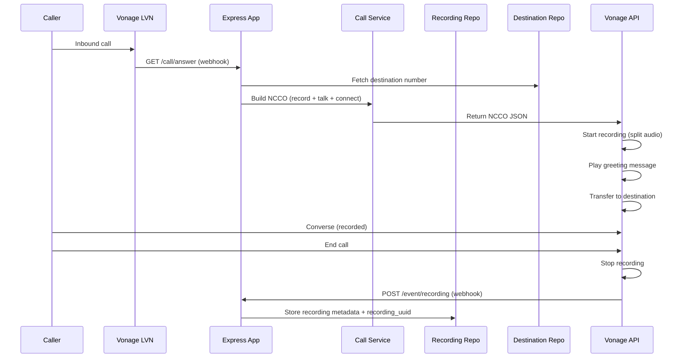
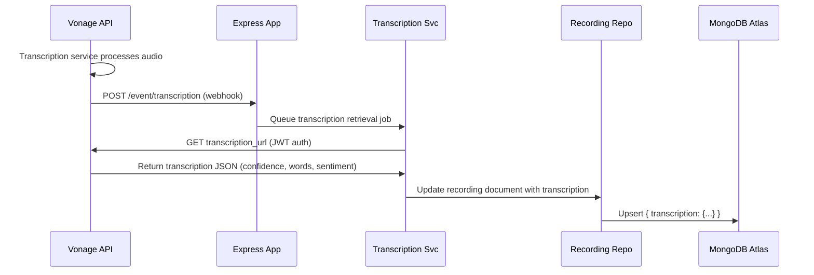
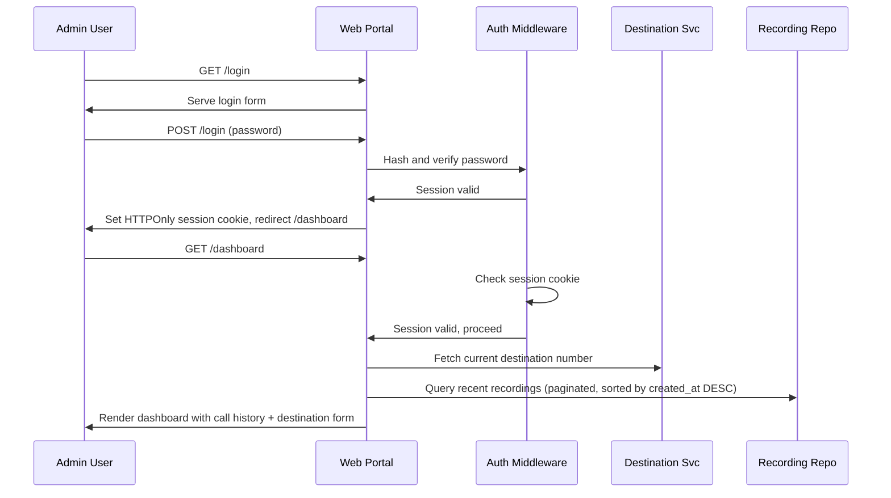

# Technical Design: Vonage Call Proxy

## Overview

The Vonage Call Proxy system orchestrates incoming calls via the Vonage Voice API, plays an automated response, transfers the call to a destination number using Voice Proxy, records the conversation with speaker separation, transcribes the audio asynchronously, and persists call metadata and recordings to MongoDB Atlas. A password-protected web portal enables administrators to configure destination numbers and retrieve call recordings and transcriptions.

**Purpose**: This feature delivers a complete call recording and transcription solution that bridges customer interactions with persistent, searchable call data.

**Users**: System administrators use the portal to configure call routing and access historical call data; end users receive calls that are transparently recorded and analyzed.

**Impact**: Transforms call infrastructure from real-time-only to persistent, auditable, and analyzable; enables compliance, quality assurance, and customer insights.

### Goals
- Handle incoming Vonage calls with automated response and proxy transfer
- Record 1:1 conversations with speaker separation (split audio)
- Transcribe recordings asynchronously via Vonage's native service
- Persist call metadata, recordings, and transcriptions to MongoDB Atlas
- Provide secure web portal for destination management and call data retrieval
- Load environment configuration from `.env` with `.env.sample` template

### Non-Goals
- Real-time transcription or live captions (asynchronous after call ends)
- Advanced analytics (sentiment analysis beyond Vonage's native feature; speaker identification beyond channel separation)
- Third-party CRM integration (future phase)
- Call forwarding or routing logic beyond single destination transfer
- Hardware or device management
- Multi-user RBAC (single admin password for MVP)

## Boundary Commitments

### This Spec Owns
- Vonage Voice API integration: incoming call handling, automated responses, call transfer via NCCO
- Call recording lifecycle: asynchronous recording with split audio, webhook callback handling
- Transcription retrieval: JWT-authenticated download of transcription_url payloads from Vonage
- MongoDB persistence layer: schema, indexes, and storage of recordings, transcriptions, and call metadata
- Web portal authentication and session management (password-based, single admin user)
- Destination number management (CRUD operations with authentication)
- Recording and transcription download endpoints with access control

### Out of Boundary
- Vonage application setup and LVN provisioning (pre-requisite)
- MongoDB Atlas cluster creation and VPC peering (pre-requisite)
- Real-time transcription or live speech-to-text streaming
- Multi-user authentication, RBAC, or federated identity (Phase 2)
- CRM integration, API gateway, or external analytics
- Audio playback or player UI (download only)
- Call routing rules or IVR logic beyond the single transfer action

### Allowed Dependencies
- **Vonage Voice API**: Incoming call reception, NCCO-based control, recording, transcription
- **MongoDB Atlas**: Cloud database for recording metadata and transcription storage
- **Node.js 18+ LTS**: Runtime environment
- **Express.js**: HTTP server and webhook handling
- **Environment variables (.env)**: Configuration management

### Revalidation Triggers
- Changes to Vonage NCCO format or webhook payload structure
- Changes to MongoDB schema (caller_id, destination_id field names/types)
- Changes to recording download or transcription webhook URL formats
- Addition of multi-user authentication or role-based access control
- Introduction of external transcription service (replacing Vonage native)

---

## Architecture

### Existing Architecture Analysis
This is a greenfield project. No existing systems to integrate with or constraints to work around.

### Architecture Pattern & Boundary Map

```mermaid
graph TB
  Caller["📱 Incoming Caller"]
  Vonage["Vonage Voice API<br/>(LVN & Webhooks)"]
  AppServer["Express.js Server"]
  CallHandler["Call Handler Service"]
  RecordingRepo["Recording Repository<br/>(MongoDB)"]
  TranscriptionSvc["Transcription Service<br/>(Async)"]
  Portal["Web Portal<br/>(Session Auth)"]
  DestRepo["Destination Repo<br/>(MongoDB)"]
  Admin["Admin User"]

  Caller -->|Inbound call| Vonage
  Vonage -->|Answer callback<br/>(GET /call/answer)| AppServer
  AppServer -->|NCCO with Record<br/>+ Talk + Connect| Vonage
  Caller -->|Transfer to dest| Vonage
  Vonage -->|Recording webhook<br/>(POST /event/recording)| AppServer
  AppServer --> CallHandler
  CallHandler --> RecordingRepo
  Vonage -->|Transcription webhook<br/>(POST /event/transcription)| AppServer
  AppServer --> TranscriptionSvc
  TranscriptionSvc -->|Retrieve transcription<br/>via JWT| Vonage
  TranscriptionSvc --> RecordingRepo
  Admin -->|Login| Portal
  Portal -->|Manage destination| DestRepo
  Portal -->|Query call history<br/>Download recording| RecordingRepo
  AppServer --> Portal
```

**Architecture Integration**:
- **Selected Pattern**: Layered hexagonal (service layer, repository pattern) within Express.js monolith. Async handlers for event processing.
- **Domain Boundaries**:
  - **Call Handler Domain**: Receives and processes incoming Vonage webhooks; manages NCCO responses and call state.
  - **Recording Domain**: Stores call metadata (conversation_uuid, recording_uuid, caller_id, destination_id) and transcription payloads in MongoDB.
  - **Portal Domain**: Serves web interface, manages user sessions, destination management, and call data queries.
  - **Transcription Domain**: Asynchronously retrieves transcription results via JWT and updates MongoDB.
- **Existing Patterns Preserved**: N/A (greenfield)
- **New Components Rationale**:
  - **Call Handler Service**: Decouples webhook processing from HTTP response; enables async job handling without blocking caller
  - **Transcription Service**: Manages retries and JWT authentication for external (Vonage) API calls; encapsulates transcription retrieval logic
  - **Recording Repository**: Abstracts MongoDB access; enables schema changes without affecting service layer
  - **Web Portal**: Isolated controller layer for UI concerns (authentication, session, HTML rendering)
- **Steering Compliance**: Follows Node.js/Express ecosystem best practices; separates business logic (Service) from persistence (Repository) and HTTP concerns (Controller)

### Technology Stack

| Layer | Choice / Version | Role in Feature | Notes |
|-------|------------------|-----------------|-------|
| **Frontend / UI** | Express.js + EJS templates | Server-rendered web portal for authentication, destination management, call history | Stateless templates; session stored in Express memory (MVP) |
| **Backend / Services** | Express.js 4.18+ | HTTP server for Vonage webhooks and portal routes | Lightweight, async-first framework suitable for webhook handling |
| **Voice SDK** | @vonage/server-sdk 3.0+ | Vonage API client; call operations, JWT generation | Native Node.js SDK with full NCCO and recording support |
| **Data / Storage** | MongoDB Atlas 5.0+ | Persistent storage of recordings, transcriptions, metadata | Document-oriented; supports TTL indexes for retention policy |
| **ODM** | Mongoose 6.0+ | Schema definition and query abstraction for MongoDB | Type-safe schema enforcement; middleware hooks for validation |
| **Authentication** | bcrypt 5.x | Password hashing for web portal | Industry standard; slow hash function prevents brute force |
| **Session Management** | express-session 1.17+ | HTTPOnly session cookies | Secure by default (HttpOnly, Secure flags); memory store for MVP |
| **Environment Config** | dotenv 16.x | Load credentials from .env file | Prevent hardcoding secrets; .env.sample for template |
| **Runtime** | Node.js 18 LTS | Server runtime | LTS stable; required by Vonage SDK and modern async/await |

---

## File Structure Plan

### Directory Structure
```
src/
├── domains/
│   ├── call/                       # Call handling domain (Vonage webhooks)
│   │   ├── call.controller.ts       # HTTP endpoints for /call/answer, /event/*
│   │   ├── call.service.ts          # NCCO generation, call state management
│   │   ├── call.types.ts            # TypeScript types for NCCO, Call
│   │   └── call.repository.ts       # Recording persistence (delegates to Recording)
│   │
│   ├── recording/                  # Recording and transcription domain
│   │   ├── recording.controller.ts  # HTTP GET /api/recordings, /api/recordings/:id/download
│   │   ├── recording.service.ts     # Transcription retrieval, status tracking
│   │   ├── recording.repository.ts  # MongoDB persistence via Mongoose
│   │   ├── recording.model.ts       # Mongoose schema definition
│   │   └── recording.types.ts       # TypeScript interfaces for Recording, Transcription
│   │
│   ├── destination/                # Destination number management
│   │   ├── destination.controller.ts # HTTP POST/GET /api/destination
│   │   ├── destination.service.ts    # CRUD logic for destination number
│   │   ├── destination.repository.ts # MongoDB persistence
│   │   ├── destination.model.ts      # Mongoose schema
│   │   └── destination.types.ts      # TypeScript interfaces
│   │
│   └── portal/                     # Web portal (session auth, UI)
│       ├── portal.controller.ts      # Login, logout, dashboard routes
│       ├── portal.service.ts         # Session validation, query call history
│       ├── auth.middleware.ts        # Express middleware for session/auth checks
│       └── portal.types.ts           # Portal session and request types
│
├── shared/
│   ├── config.ts                    # Environment loading (dotenv)
│   ├── vonage.client.ts             # Vonage SDK initialization with JWT
│   ├── database.ts                  # MongoDB connection and Mongoose setup
│   ├── logger.ts                    # Structured logging
│   ├── error.handler.ts             # Centralized error handling middleware
│   └── types.ts                     # Global TypeScript types
│
├── views/
│   ├── login.ejs                    # Login form
│   ├── dashboard.ejs                # Call history, destination mgmt
│   ├── layout.ejs                   # Base HTML layout
│   └── error.ejs                    # Error page
│
├── app.ts                           # Express app setup and middleware
├── server.ts                        # Server entry point
└── config.ts                        # Shared configuration

.env.sample                          # Environment template (no secrets)
.env                                 # Secrets (git-ignored)
package.json
tsconfig.json
```

**Modified Files**: None (greenfield)

**Key Responsibilities**:
- `call.controller.ts`: Routes `/call/answer` (answer incoming call) and `/event/recording` (recording webhook)
- `call.service.ts`: Builds NCCO with `record` action (split, transcription options), `talk` action (greeting), `connect` action (transfer)
- `recording.repository.ts`: MongoDB upsert for recording metadata; async transcription field updates
- `destination.service.ts`: CRUD for destination number; single record pattern (always read/update same doc)
- `portal.controller.ts`: Login/logout, dashboard (GET call history), destination form (POST/GET)
- `vonage.client.ts`: Singleton Vonage client with JWT generation; reused across services

---

## System Flows

### Call Handling and Recording Flow



**Flow-Level Decisions**:
- Asynchronous recording: No `endOnSilence` or `endOnKey`; recording continues until call ends
- Split recording: `"split": "conversation"` enables stereo file with caller in left channel, callee in right
- Transfer timing: Greeting plays before transfer to allow delay for destination routing setup
- Webhook reliability: All events posted to separate webhook endpoints to enable idempotent processing

### Transcription Retrieval Flow



**Flow-Level Decisions**:
- Asynchronous processing: Transcription retrieval does not block webhook response; async/await with error handling
- JWT authentication: Vonage client SDK handles JWT signing; no manual token management
- Retry logic: Exponential backoff (3 retries, 5s/10s/30s delays) for transient network failures
- Idempotency: Upsert on recording_uuid ensures duplicate webhook payloads are safely ignored

### Web Portal Authentication and Call History Query



**Flow-Level Decisions**:
- Session-based auth: HTTPOnly, Secure flags prevent XSS and MITM
- Password verification: Bcrypt comparison in-memory; never log or transmit plaintext
- Authorization: Middleware checks session existence before calling service methods
- Pagination: Dashboard shows last 50 calls; pagination handled by `skip()/limit()` in Mongoose

---

## Requirements Traceability

| Requirement | Summary | Components | Interfaces | Flows |
|---|---|---|---|---|
| 1.1 | Answer incoming call, play greeting | Call Controller, Call Service | NCCO JSON | Call Handling flow |
| 1.2 | Transfer call to destination number | Call Service, Destination Repo | NCCO with connect action | Call Handling flow |
| 1.3 | Record 1:1 conversation | Call Service, Recording Service | NCCO record action (split) | Call Handling + Recording flows |
| 1.4 | Log and notify on transfer failure | Call Service error handler | Error webhook endpoint | Call error handling |
| 2.1 | Initiate transcription on call end | Recording Service, Transcription Svc | Transcription webhook handler | Transcription retrieval flow |
| 2.2 | Generate transcription text | Transcription Service (Vonage native) | JWT-authenticated download | Transcription retrieval flow |
| 2.3 | Store transcription, caller, destination IDs | Recording Repository | MongoDB upsert schema | Recording storage |
| 3.1 | Require password authentication | Portal Auth Middleware | Login POST, session check | Web Portal auth flow |
| 3.2 | Allow destination number input and save | Destination Controller, Service | POST /api/destination, validation | Web Portal destination mgmt |
| 3.3 | Display transcribed text on portal | Recording Controller | GET /api/recordings/:id | Web Portal call history |
| 3.4 | Provide recording download button | Recording Controller | GET /api/recordings/:id/download | Web Portal download flow |
| 4.1 | Store transcription + caller + dest in MongoDB | Recording Model, Schema | Mongoose Recording schema | Recording storage |
| 4.2 | Load credentials from .env file | Config module | dotenv.config() | Server startup |
| 4.3 | Provide .env.sample template | Config docs | .env.sample file | Setup documentation |

---

## Components and Interfaces

### Summary Table

| Component | Domain/Layer | Intent | Req Coverage | Key Dependencies (P0/P1) | Contracts |
|---|---|---|---|---|---|
| Call Controller | API / Webhooks | Handle `/call/answer` and `/event/recording` endpoints | 1.1, 1.2, 1.3, 1.4 | Call Service (P0), Destination Repo (P0) | API |
| Call Service | Business Logic | Generate NCCO; manage call state and transitions | 1.1, 1.2, 1.3 | Vonage Client (P0), Recording Repo (P1) | Service |
| Recording Repository | Data Layer | Persist and query recording documents in MongoDB | 2.3, 4.1 | MongoDB (P0), Recording Model (P0) | Repository |
| Transcription Service | Business Logic | Retrieve transcription via JWT; handle retries | 2.1, 2.2, 2.3 | Vonage Client (P0), Recording Repo (P0) | Service |
| Destination Service | Business Logic | CRUD operations for destination number | 1.2, 3.2 | Destination Repo (P0) | Service |
| Portal Controller | Web / UI | Handle login, dashboard, download requests | 3.1, 3.2, 3.3, 3.4 | Auth Middleware (P0), Recording Repo (P1) | API, Web |
| Auth Middleware | Cross-cutting | Validate session; enforce password authentication | 3.1 | Express Session (P0) | Middleware |
| Vonage Client | External Integration | Vonage SDK initialization; JWT generation | 1.1, 1.2, 1.3, 2.2 | Vonage API (P0), Config (P0) | Service |

---

### Call Handler

#### Call Controller

| Field | Detail |
|---|---|
| Intent | Handle HTTP webhooks from Vonage: incoming call answer requests and recording event callbacks |
| Requirements | 1.1, 1.2, 1.3, 1.4 |

**Responsibilities & Constraints**
- Route `GET /call/answer` (webhook when incoming call arrives) to Call Service
- Route `POST /event/recording` (webhook when recording completes) to Recording Repository
- Route `POST /event/transcription` (webhook when transcription completes) to Transcription Service
- Return NCCO JSON to Vonage for answer endpoint
- Return 200 OK immediately for event webhooks (fire-and-forget; async processing)
- Validate webhook authenticity via Vonage signature verification (if enabled)

**Dependencies**
- Inbound: Express Request/Response middleware
- Outbound: Call Service (generate NCCO), Destination Repository (fetch destination), Recording Repository (store metadata)
- External: Vonage Voice API (sends webhooks)

**Contracts**: API [x] / Service [ ] / Event [ ] / Batch [ ] / State [ ]

##### API Contract
| Method | Endpoint | Request | Response | Errors |
|---|---|---|---|---|
| GET | /call/answer | `?to=<number>&from=<number>&uuid=<call_uuid>&conversation_uuid=<conv_uuid>` | JSON NCCO array | 500 if destination fetch fails |
| POST | /event/recording | JSON: `{ conversation_uuid, recording_uuid, status, transcription_url }` | 200 OK | 400 if parsing fails, 500 if DB error |
| POST | /event/transcription | JSON: `{ conversation_uuid, recording_uuid, transcription_url, status }` | 200 OK | 400 if parsing fails, 500 if DB error |

**Implementation Notes**
- Integration: Decode query parameters; do not trust `from` or `to` directly (spoof-able); use conversation_uuid as primary identifier
- Validation: Verify NCCO syntax before returning to Vonage (type-check action objects)
- Risks: Webhook delays (30s timeout) could cause Vonage to retry; ensure idempotent upserts in Repository

---

#### Call Service

| Field | Detail |
|---|---|
| Intent | Encapsulate NCCO generation and call control logic; separate from HTTP concerns |
| Requirements | 1.1, 1.2, 1.3 |

**Responsibilities & Constraints**
- Build NCCO actions in correct order: `record` → `talk` → `connect`
- Configure `record` action: enable split recording, specify transcription options (language: en-US), set eventUrl
- Configure `talk` action: play greeting message text (from config)
- Configure `connect` action: transfer to destination number with from caller ID
- Handle missing destination gracefully (return error NCCO with fail message)
- Validate NCCO schema before returning (action type, endpoint type, etc.)

**Dependencies**
- Inbound: Call Controller, Destination Repository (for destination number)
- Outbound: Vonage Client (for SDK types/constants if needed)
- External: None

**Contracts**: Service [x] / API [ ] / Event [ ] / Batch [ ] / State [ ]

##### Service Interface
```typescript
interface CallService {
  buildAnswerNCCO(options: {
    conversationUuid: string;
    callUuid: string;
    destinationNumber: string;
  }): NCCO;
}

interface NCCO {
  action: "record" | "talk" | "connect";
  // ... action-specific fields
}
```
- Preconditions: destinationNumber is valid phone format (E.164)
- Postconditions: Returned NCCO is a valid array of actions, compilable to JSON
- Invariants: Action order is immutable; no side effects on repositories

**Implementation Notes**
- Integration: Call Service does not call Repository; caller (Controller) fetches destination and passes it
- Validation: Use Vonage SDK type definitions for NCCO action shape
- Risks: Invalid NCCO may cause Vonage to reject call; test with mock Vonage client

---

### Recording Management

#### Recording Repository

| Field | Detail |
|---|---|
| Intent | Abstract MongoDB persistence; provide CRUD and query interface for recording documents |
| Requirements | 2.3, 4.1 |

**Responsibilities & Constraints**
- Upsert recording document on webhook (matching by conversation_uuid or recording_uuid)
- Store recording metadata: conversation_uuid, recording_uuid, caller_id, destination_id, created_at, updated_at
- Update transcription field once available (async)
- Query recordings by caller_id, date range, conversation_uuid
- Implement pagination for dashboard queries
- Enforce data consistency: all fields present or fail

**Dependencies**
- Inbound: Recording Controller, Call Controller, Transcription Service
- Outbound: MongoDB Atlas via Mongoose, Recording Model (schema)
- External: None

**Contracts**: Service [x] / API [ ] / Event [ ] / Batch [ ] / State [ ]

##### Service Interface
```typescript
interface RecordingRepository {
  upsertRecording(data: {
    conversation_uuid: string;
    recording_uuid: string;
    caller_id: string;
    destination_id: string;
    recording_url: string;
    status: "recording" | "recorded" | "transcribed";
  }): Promise<Recording>;

  updateTranscription(recordingUuid: string, transcription: {
    text: string;
    confidence: number;
    sentiments?: Array<{ text_part: string; score: number }>;
  }): Promise<Recording>;

  findByConversationUuid(uuid: string): Promise<Recording | null>;
  findByCallerId(callerId: string, options: { skip: number; limit: number }): Promise<Recording[]>;
}

interface Recording {
  _id: ObjectId;
  conversation_uuid: string;
  recording_uuid: string;
  caller_id: string;
  destination_id: string;
  recording_url: string;
  transcription?: { text: string; confidence: number; ... };
  status: "recording" | "recorded" | "transcribed";
  created_at: Date;
  updated_at: Date;
}
```
- Preconditions: caller_id and destination_id are non-empty strings; recording_uuid is unique
- Postconditions: Document persisted and indexed; subsequent queries see updated data
- Invariants: Only one Recording per conversation_uuid; status transitions are monotonic (recording → recorded → transcribed)

**Implementation Notes**
- Integration: Use Mongoose `.findOneAndUpdate({ conversation_uuid }, ..., { upsert: true })` for idempotent upserts
- Validation: Validate phone number formats; reject if caller_id or destination_id invalid
- Risks: Concurrent updates to same document; use atomic operators to avoid race conditions

---

#### Transcription Service

| Field | Detail |
|---|---|
| Intent | Asynchronously retrieve transcription results from Vonage via JWT-authenticated API calls; handle retries and error recovery |
| Requirements | 2.1, 2.2, 2.3 |

**Responsibilities & Constraints**
- Listen for transcription webhook (via Controller)
- Queue transcription retrieval job (async/await, no message queue in MVP)
- Retry failed downloads with exponential backoff (3 retries: 5s, 10s, 30s)
- Authenticate GET request to transcription_url using Vonage client JWT
- Parse transcription response; extract text, confidence, sentiments
- Update Recording document with transcription data
- Log all attempts and failures for audit

**Dependencies**
- Inbound: Call Controller (receives webhook), Recording Repository (for updates)
- Outbound: Vonage Client (JWT generation, HTTP GET), Recording Repository (update)
- External: Vonage transcription_url (time-limited, expires after 30 days)

**Contracts**: Service [x] / API [ ] / Event [ ] / Batch [ ] / State [ ]

##### Service Interface
```typescript
interface TranscriptionService {
  retrieveAndStore(payload: {
    conversation_uuid: string;
    recording_uuid: string;
    transcription_url: string;
  }): Promise<void>;
}
```
- Preconditions: transcription_url is a valid HTTPS URL; recording exists in MongoDB
- Postconditions: Transcription stored in Recording document; status updated to "transcribed"
- Invariants: Retries are idempotent (multiple calls with same payload succeed without duplicate updates)

**Implementation Notes**
- Integration: Call Controller queues job and returns 200 immediately; TranscriptionService runs in background
- Validation: Verify response status code; parse JSON safely (try/catch); validate transcription payload structure
- Risks: transcription_url expires; implement fallback or alert if download fails after retries

---

#### Recording Model & Schema

```typescript
// Mongoose Schema Definition
const recordingSchema = new Schema({
  conversation_uuid: { type: String, required: true, unique: true, index: true },
  recording_uuid: { type: String, required: true },
  caller_id: { type: String, required: true, index: true },
  destination_id: { type: String, required: true },
  recording_url: { type: String, required: true },
  transcription: {
    text: String,
    confidence: Number,
    sentiments: [
      {
        text_part: String,
        score: Number
      }
    ]
  },
  status: { type: String, enum: ["recording", "recorded", "transcribed"], default: "recording" },
  created_at: { type: Date, default: Date.now, index: true },
  updated_at: { type: Date, default: Date.now }
}, { timestamps: true });

// Indexes
recordingSchema.index({ caller_id: 1, created_at: -1 });  // For dashboard queries
recordingSchema.index({ conversation_uuid: 1 });          // Primary lookup
recordingSchema.index({ created_at: 1 }, { expireAfterSeconds: 2592000 }); // TTL: 30 days (optional)
```

---

### Destination Management

#### Destination Service

| Field | Detail |
|---|---|
| Intent | CRUD operations for destination phone number; single record pattern (always one active destination) |
| Requirements | 1.2, 3.2 |

**Responsibilities & Constraints**
- Fetch current destination number (single record, always return latest)
- Save/update destination number with validation (E.164 format)
- Delete destination (rarely used; return error if no destination configured)
- Return current destination to Call Service for NCCO generation

**Dependencies**
- Inbound: Call Service, Portal Controller
- Outbound: Destination Repository
- External: None

**Contracts**: Service [x] / API [ ] / Event [ ] / Batch [ ] / State [ ]

##### Service Interface
```typescript
interface DestinationService {
  getCurrent(): Promise<{ number: string }>;
  save(number: string): Promise<{ number: string }>;
}
```
- Preconditions: number is in E.164 format (e.g., +1234567890)
- Postconditions: Destination stored and immediately available to Call Service
- Invariants: Only one destination record exists; updates replace previous value

---

### Web Portal & Authentication

#### Portal Controller

| Field | Detail |
|---|---|
| Intent | Serve web interface endpoints: login, dashboard, API endpoints for call data and destination management |
| Requirements | 3.1, 3.2, 3.3, 3.4 |

**Responsibilities & Constraints**
- Route `GET /login` → render login form
- Route `POST /login` → verify password, set HTTPOnly session cookie, redirect
- Route `GET /logout` → clear session, redirect to login
- Route `GET /dashboard` → require auth, render call history and destination form
- Route `GET /api/recordings` → return JSON list of recent recordings (paginated)
- Route `GET /api/recordings/:id/download` → return file download (authenticated, rate-limited)
- Route `POST/GET /api/destination` → manage destination number (authenticated)

**Dependencies**
- Inbound: Auth Middleware (session check), Express Request/Response
- Outbound: Recording Repository (query history), Destination Service (fetch/save), Portal Service (query helpers)
- External: None

**Contracts**: API [x] / Web [x] / State [ ] / Batch [ ] / Event [ ]

##### API Contract (JSON Endpoints)
| Method | Endpoint | Request | Response | Errors |
|---|---|---|---|---|
| GET | /api/recordings | `?page=1&limit=50` | `{ recordings: [...], total: N, page: 1 }` | 401 if not authenticated, 500 if DB error |
| GET | /api/recordings/:id/download | Query params: `?format=json\|audio` | File download (audio/mpeg or application/json) | 401, 404 if not found, 429 if rate-limited |
| POST | /api/destination | JSON: `{ number: string }` | `{ number: string }` | 401, 400 if invalid format, 500 if DB error |
| GET | /api/destination | None | JSON: `{ number: string }` | 401, 404 if not configured |

##### Web Routes (Server-Rendered HTML)
| Route | Method | Purpose | Auth Required |
|---|---|---|---|
| /login | GET | Serve login form | No |
| /login | POST | Process login form | No |
| /logout | GET | Clear session | Yes |
| /dashboard | GET | Render call history + destination form | Yes |

**Implementation Notes**
- Integration: Use EJS templates; session stored in Express memory (production: Redis)
- Validation: Sanitize user input (call history filters, destination number format)
- Risks: CSRF tokens required for form submissions; XSS prevention via EJS escaping

---

#### Auth Middleware

| Field | Detail |
|---|---|
| Intent | Express middleware to enforce session-based authentication; check HTTPOnly cookies before allowing access to protected routes |
| Requirements | 3.1 |

**Responsibilities & Constraints**
- Check request for valid session cookie (HttpOnly, Secure flags)
- Validate session exists and has not expired
- Allow request to proceed if valid; reject (401) if invalid or missing
- Log authentication failures for audit

**Dependencies**
- Inbound: Express Request/Response, Express Session middleware
- Outbound: None
- External: None

**Contracts**: Middleware [x]

##### Implementation
```typescript
const authRequired = (req: Request, res: Response, next: NextFunction) => {
  if (!req.session || !req.session.authenticated) {
    return res.status(401).redirect('/login');
  }
  next();
};
```
- Preconditions: Express session middleware already configured
- Postconditions: Request proceeds if authenticated; otherwise 401 response
- Invariants: Middleware is stateless and idempotent

---

## Data Models

### Domain Model
- **Aggregate Root**: Recording
  - Entity: Transcription (value object embedded in Recording)
  - Business Rule: A recording can only have one transcription (1:1 relationship)
  - Domain Event: RecordingCompleted, TranscriptionCompleted (implicit; no event sourcing in MVP)

- **Aggregate Root**: Destination
  - Value Object: PhoneNumber (E.164 format)
  - Business Rule: Only one active destination at a time
  - Invariant: Destination cannot be deleted if no alternative configured

### Logical Data Model

**Structure Definition**:
- **Recording Collection**:
  - conversation_uuid (String, unique, primary key)
  - recording_uuid (String, indexed)
  - caller_id (String, indexed, E.164 format)
  - destination_id (String, E.164 format)
  - recording_url (String, Vonage download URL with JWT)
  - transcription (nested object):
    - text (String, transcription text)
    - confidence (Number, 0–1 range)
    - sentiments (Array of sentiment scores per phrase)
  - status (Enum: "recording", "recorded", "transcribed")
  - created_at (Date, indexed, for queries and TTL)
  - updated_at (Date, for audit)

- **Destination Collection**:
  - _id (ObjectId)
  - number (String, E.164 format, required)
  - updated_at (Date)

**Consistency & Integrity**:
- Transaction Boundaries: Single-document ACID transactions in MongoDB; no cross-collection transactions
- Cascading Rules: Deleting Destination does not cascade; Call Handler will fail if destination missing
- Temporal Aspects: created_at is immutable; updated_at changes on each modification; TTL index auto-expires after 30 days (optional)
- Referential Integrity: No foreign key constraints (MongoDB is schemaless); application layer validates destination_id exists

### Physical Data Model

**MongoDB Atlas Document Store**:
- **Collections**: `recordings`, `destinations`
- **Embedding vs Referencing**: Transcription embedded in Recording (denormalized) to avoid join queries
- **Sharding Strategy** (future): Shard by `caller_id` or `created_at` if data exceeds single-node limits
- **Indexes**:
  - `recordings.conversation_uuid` (unique, primary)
  - `recordings.caller_id` with `created_at` descending (for dashboard pagination)
  - `recordings.created_at` with TTL expiration (optional, 30-day retention)
  - `destinations._id` (default)

**Performance Considerations**:
- Working set: Recording documents + indexes fit in RAM (< 10GB for typical deployment)
- Query patterns: Recent recordings by caller_id (range + sort), fetch by conversation_uuid (point query)
- Write throughput: Recording creation (webhook) and transcription update (async) are low-frequency; no batching required

---

## Error Handling

### Error Strategy

**Fail-Fast Validation**:
- Reject invalid NCCO at Call Service level before returning to Vonage
- Validate phone number formats (E.164) at Controller boundary
- Return 400 Bad Request for malformed JSON payloads

**Graceful Degradation**:
- If destination fetch fails: return NCCO with talk message ("Service unavailable") instead of crashing
- If transcription retrieval fails: log error, retry 3 times, then mark Recording as "recorded" (skip transcription)
- If MongoDB unavailable: return 500; Vonage will retry webhook (idempotent upsert)

**Business Logic Errors** (unrecoverable):
- Invalid NCCO syntax → 500 (internal error, do not retry)
- Call transfer failure → logged to Recording status, admin notified via email (future feature)
- Password mismatch → 401 Unauthorized, no detailed error message (prevent user enumeration)

### Error Categories and Responses

| Category | Example | Response | Recovery |
|---|---|---|---|
| **User Errors (4xx)** | Invalid destination format | 400 Bad Request, field validation message | User corrects input |
| **Auth Errors (4xx)** | Invalid password | 401 Unauthorized | Retry login |
| **Not Found (4xx)** | Recording ID not found | 404 Not Found | Inform user |
| **System Errors (5xx)** | MongoDB connection failure | 500 Internal Server Error | Retry (Vonage will retry webhook) |
| **Rate Limit (429)** | Download abuse detected | 429 Too Many Requests | Retry after Retry-After header |

### Monitoring

- Log all webhook payloads (conversation_uuid, recording_uuid) for auditability
- Log authentication failures (login attempts, session expirations)
- Alert on transcription retrieval failures (after retries exhausted)
- Monitor MongoDB connection pool exhaustion; alert if > 80% capacity
- Track recording download frequency per session (rate limiting)

---

## Testing Strategy

### Unit Tests
- **Call Service**: NCCO generation with valid/invalid inputs; split recording flag enabled
- **Recording Model**: Schema validation (E.164 phone format, status enum)
- **Transcription Service**: Retry logic (exponential backoff), JWT generation for authenticated requests
- **Auth Middleware**: Session validation, HTTP status codes for auth success/failure
- **Destination Service**: Phone number format validation (E.164)

### Integration Tests
- **Call Handler → Recording Repo**: Webhook payload → MongoDB upsert; verify idempotence
- **Transcription Service → Recording Repo**: Retrieve transcription_url → update Recording; verify status transitions
- **Portal Controller → Recording Repo**: Query dashboard; pagination, filtering by caller_id, sorting by date
- **Portal Controller → Auth Middleware**: Login form → session creation; logout → session deletion

### E2E / Scenario Tests
- **End-to-End Call Flow**: Mock Vonage API; simulate incoming call → recording webhook → transcription webhook; verify final Recording document in MongoDB
- **Web Portal Flow**: Login → navigate to dashboard → view call history → download recording → manage destination → logout
- **Error Scenarios**: Destination missing → NCCO falls back to message; transcription fails → retry logic engages; MongoDB offline → 500 error

### Performance / Load Tests
- **Webhook concurrency**: 10 simultaneous recording webhooks; verify no race conditions in MongoDB upserts
- **Dashboard pagination**: Query 1,000+ recordings with sorting/filtering; verify response < 200ms
- **Download throughput**: 5 concurrent downloads; verify rate limiting and bandwidth control

---

## Optional Sections

### Security Considerations
- **Authentication**: Session-based with HTTPOnly, Secure cookies; password hashed with bcrypt (10–12 rounds)
- **Authorization**: Middleware enforces session check on protected routes; single admin user (password-based) for MVP
- **Data Protection in Transit**: HTTPS enforced for all endpoints; Vonage APIs use HTTPS with JWT signatures
- **Data Protection at Rest**: MongoDB Atlas encryption at rest (optional, enabled in production); .env file with secrets never committed
- **Secret Management**: Vonage API keys, MongoDB URI, and admin password stored in .env; rotated regularly (procedure TBD)
- **Input Validation**: Phone numbers validated against E.164 format; NCCO JSON schema validated before returning to Vonage
- **Audit Logging**: All authentication attempts, downloads, and destination changes logged with timestamp and user session ID

### Performance & Scalability
- **Target Metrics**:
  - Call answer latency: < 1 second (NCCO generation + return)
  - Dashboard page load: < 500ms (query + render)
  - Recording download: streaming (no in-memory buffering)
  - Webhook processing: < 5 seconds (async, does not block Vonage timeout)
  
- **Scaling Approaches**:
  - Horizontal: Deploy multiple Express instances behind load balancer; session store moved to Redis
  - Vertical: Increase Node.js heap for larger pagination queries; MongoDB index optimization
  - Asynchronous: Message queue (Bull + Redis) for transcription jobs in Phase 2 to decouple from webhook response

- **Caching Strategies**:
  - Destination number cached in-memory with 5-minute TTL (low change frequency)
  - Recording query results not cached (freshness required for compliance)
  - MongoDB indexes on caller_id, created_at, conversation_uuid (primary scaling lever)

---

## Supporting References

### Vonage NCCO Action Definitions
```typescript
// record action (split recording with transcription)
{
  "action": "record",
  "eventUrl": ["https://your-domain.com/event/recording"],
  "split": "conversation",
  "format": "mp3",
  "transcription": {
    "eventMethod": "POST",
    "eventUrl": ["https://your-domain.com/event/transcription"],
    "language": "en-US",
    "sentimentAnalysis": true
  }
}

// talk action (greeting message)
{
  "action": "talk",
  "text": "Your call is being recorded. Press 1 to continue, or hang up."
}

// connect action (transfer)
{
  "action": "connect",
  "from": "<vonage-lvn>",
  "endpoint": [
    {
      "type": "phone",
      "number": "<destination>"
    }
  ]
}
```

### Mongoose Recording Schema Example
```typescript
const recordingSchema = new Schema({
  conversation_uuid: { type: String, required: true, unique: true },
  recording_uuid: { type: String, required: true },
  caller_id: { type: String, required: true },
  destination_id: { type: String, required: true },
  recording_url: String,
  transcription: {
    text: String,
    confidence: Number,
    sentiments: [{ text_part: String, score: Number }]
  },
  status: { type: String, enum: ["recording", "recorded", "transcribed"], default: "recording" },
  created_at: { type: Date, default: Date.now },
  updated_at: { type: Date, default: Date.now }
});
```

---

## Design Summary

This design translates requirements into a layered, event-driven architecture built on Express.js, Vonage Voice API, and MongoDB Atlas. The system cleanly separates concerns across Call Handling, Recording Management, Destination Configuration, and Web Portal domains, with explicit interfaces between each layer. Asynchronous processing via webhooks and async/await patterns ensures responsive API interactions without blocking long-running operations. Security is enforced through session-based authentication, password hashing, and explicit authorization checks. The schema design leverages MongoDB's document model to co-locate transcription metadata with recordings, enabling efficient queries and eliminating JOIN complexity. Performance targets are met through strategic indexing, pagination, and caching. The design is prepared for Phase 2 enhancements (RBAC, message queues, semantic search, third-party transcription fallback) without requiring architectural changes.
